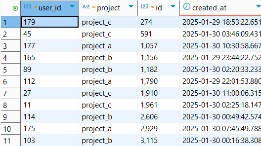

## Задание 2.

- [Docker Compose файл](docker-compose.yaml)

При развертывании добавил новый контейнер для pg admin. Непосредственно в pg admin подключился к postgres базе данных 
через network создаваемый в контейнере postgres с ip, который можно увидеть на скриншоте(на скриншоте ip инстанса, по факту необходимо использовать ip шлюз).

На этом скриншоте виден ip, который можно использовать в качестве шлюза.

- [Код DAG](src/maxibitsolutionstestproject/airflow/dags/weather_dag.py)
- [Паркетные файлы](src/maxibitsolutionstestproject/airflow/dags/temperature_data/minsk_2025_05_14_temp.parquet)

## Задание 3.
- Для настройки Airflow установил Postgres провайдер, а также python-telegram-bot (для реализации отправки 
алертов об ошибке в телеграм чат).
- Для конфигурации подключения к базе данных будем использовать докер контейнеры, через которые мы создадим отдельные сервера под все хосты project хосты, а также под аналитическое ХД.
Под каждый хост необходимо создать свой volume. По необходимости обновить healtcheck, чтобы получать информацию в логи о падении postgres сервера.

- [Скрипт создания всех таблиц и view](analytics_creation_script.sql)

Описание: Создадим некоторое подобие star schema. Основной таблицей будет user_sessions к ней буду джоинить данные и создавать материализованые вьюхи.
В качестве dimensional таблиц будут выступать events, transactions, exchange_rates, pages. Сделал view `transactions_in_usd`, которая переводит все транзакции в доллары.

Затем сделал материализованные view `first_successful_transaction` и `first_successful_transaction_in_usd`, чтобы найти первую успешную транзакцию для текущей сессии, и первую успешную транзакцию для текущей сессии в долларах.

После чего сделал материализованную view, которая подсчитывает сумму успешных транзакций за сессию в долларах `sum_of_transactions_in_session`.

Собрал все материализованные view в `session_analytics` view. Использовал left join для первой успешной транзакции в долларах, так как таковой транзакции может и не быть.

- Через оркестратор достаем данные из dimensional таблиц, сохраняем их в csv формате. В таске loadа загружаем из csv в raw dimensional таблицы, после чего делаем upsert в "clean" dimensional таблицы, которые находятся на аналитическом сервере.

- Оркестратор загружает данные каждые 10 минут.

- Масштабируемость.
Здесь не был использован спарк для трансформации, так как при масштабируемости подход со спарком был бы боттл неком, потому что была бы необходимость джоинить все данные между кластерами, что уже не является идеальным использование спарка.
На основании моего понимания - лучший метод добавить покластерную загрузку dimensional таблиц, что позволит сэкономить время на загрузку в N количество раз, где N - это количество сорсов.
Так же можно на больших таблицах, таких как events перейти на real time пайплайн, который можно реализовать через Kafka.